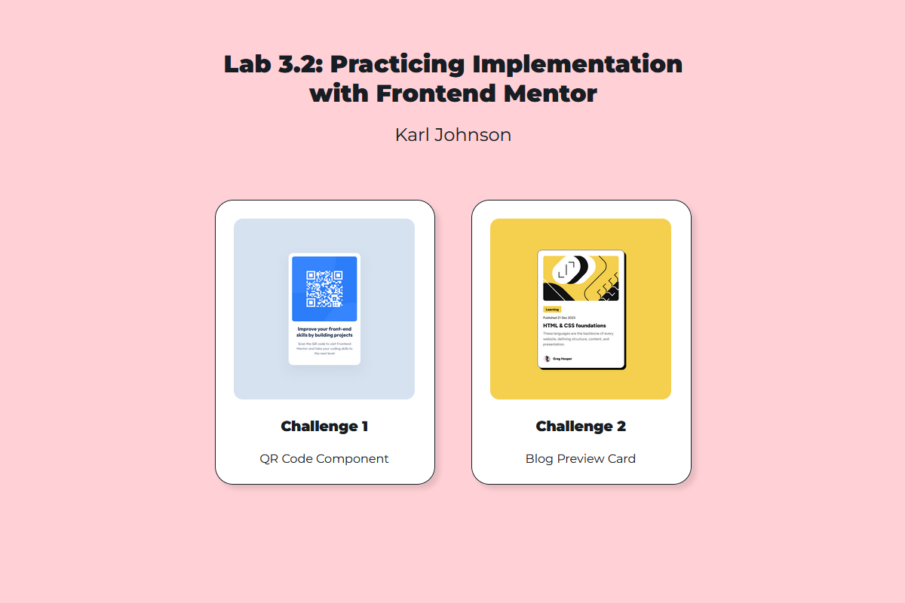

# Lab 3.2: Practicing Implementation with Frontend Mentor

[Karl Johnson](https://github.com/hirekarl/)  
2025-RTT-30  
<date datetime="2025-06-12">2025-06-12</date>  

## Overview
## Viewer Instructions
View the deployed app at [unrivaled-macaron-304227.netlify.app](https://unrivaled-macaron-304227.netlify.app/), or view individual challenge submissions below.

### Challenge Solutions

1. [Challenge 1: QR Code Component](https://unrivaled-macaron-304227.netlify.app/01_qr_code_component/index.html) ([source](./01_qr_code_component/))
2. [Challenge 2: Blog Preview Card](https://unrivaled-macaron-304227.netlify.app/02_blog_preview_card/index.html) ([source](./02_blog_preview_card/))
3. *TODO* (*I'm going to come back to this when I have more time*) ([Scrimba's code-along](https://v2.scrimba.com/build-a-space-travel-website-c014))

### Scenario
In a professional setting, developers often work from detailed Figma designs to build high-quality, pixel-perfect web components. To strengthen your development skills, this lab will introduce you to Frontend Mentor, a tool providing real-world coding challenges. Frontend Mentor will help you practice translating Figma designs into HTML and CSS and give you a taste of professional front-end development workflows. The hands-on challenges will enhance your proficiency with core web development tools and refine your ability to implement design specifications accurately.

### Objectives
By the end of this lab, you will be able to:

- Create an account and navigate the Frontend Mentor platform.
- Complete two foundational Frontend Mentor challenges using HTML and CSS.
- Optionally complete additional challenges to build more complex web components.

### Challenge Instructions

1. Required: [QR Code Component Challenge](https://www.frontendmentor.io/challenges/qr-code-component-iux_sIO_H)
2. Required: [Blog Preview Card](https://www.frontendmentor.io/challenges/blog-preview-card-ckPaj01IcS)
3. Optional: [Space Tourism Multi-Page Website](https://www.frontendmentor.io/challenges/space-tourism-multipage-website-gRWj1URZ3)

## Reflection Questions
After completing these challenges, take a few minutes to answer the following questions:

1. How did using Figma designs as references affect your coding process?

*Figma was a great reference for grabbing the sizes of elements, spacing, typography, and colors necessary to implement the designs. For the Blog Preview Card, the hover state implementation of the blog post title gave me what I needed to implement a hover state pseudoclass on that element.*

2. What challenges did you encounter when aligning your code with the design specifications?

*Just normal CSS things. For the QR Code Component challenge, I implemented the image and the text below it in a `<figure>` element, and wrangling away the default styling took some effort!*

3. How can the feedback and community resources on Frontend Mentor help you improve as a developer?

*Other developers, who may have more experience with HTML and CSS, can provide invaluable feedback on challenge submissions. The templates and design kits provided by the community also provide ready-made components, styles, and other elements that can be used for wireframing and prototyping.*

## Attributions
- Challenges by [Frontend Mentor](https://www.frontendmentor.io?ref=challenge). Coded by [Karl Johnson](https://github.com/hirekarl).
