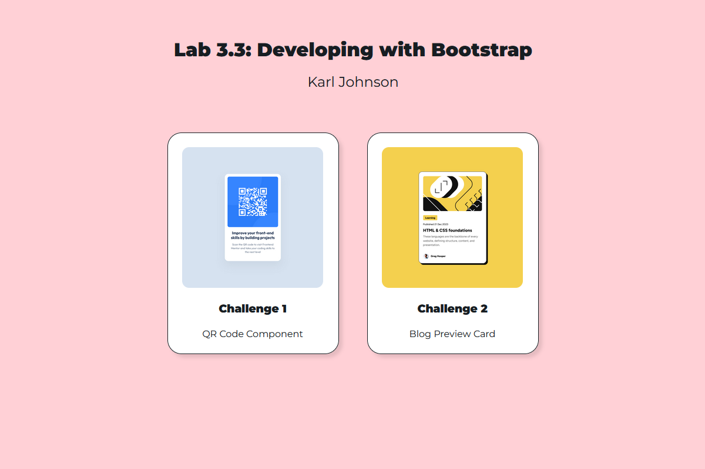

# Lab 3.3: Developing with Bootstrap

[Karl Johnson](https://github.com/hirekarl/)  
2025-RTT-30  
<date datetime="2025-06-14">2025-06-14</date>  

## Overview
### Viewer Instructions
View the deployed app at [incomparable-jelly-3af253.netlify.app](https://incomparable-jelly-3af253.netlify.app/), or view individual challenge submissions below.

### Challenge Solutions

1. [Challenge 1: QR Code Component](https://incomparable-jelly-3af253.netlify.app/01_qr_code_component/index.html) ([source](./01_qr_code_component/))
2. [Challenge 2: Blog Preview Card](https://incomparable-jelly-3af253.netlify.app/02_blog_preview_card/index.html) ([source](./02_blog_preview_card/))
3. *TODO* (*I'm going to come back to this when I have more time*) ([Scrimba's code-along](https://v2.scrimba.com/build-a-space-travel-website-c014))

## Assignment
### Scenario
Your company has recently decided to standardize all front-end projects using Bootstrap to ensure consistency and maintainability. As part of this initiative, your team has been tasked with refactoring existing projects that were previously styled with custom CSS. You will be revisiting a few of your earlier projects and converting them to use Bootstrap, ensuring that they look consistent and function well across various devices.

You will start with smaller projects, such as a QR Code Component and a Blog Preview Card, and then move on to a more complex, multi-page website project if time allows. This refactoring process is a common task in professional web development and will prepare you to handle similar scenarios in your workplace.

### Objectives
By the end of this lab, you will be able to:

- Refactor an existing project using Bootstrap’s utility classes.
- Use Bootstrap components to replace custom-styled elements.
- Apply Bootstrap’s grid system for responsive layouts.
- Demonstrate the ability to leverage Bootstrap documentation for efficient development.

### Challenge Instructions

1. Required: [QR Code Component Challenge](https://www.frontendmentor.io/challenges/qr-code-component-iux_sIO_H)
2. Required: [Blog Preview Card](https://www.frontendmentor.io/challenges/blog-preview-card-ckPaj01IcS)
3. Optional: [Space Tourism Multi-Page Website](https://www.frontendmentor.io/challenges/space-tourism-multipage-website-gRWj1URZ3)

## Reflection Questions
Once you have completed refactoring the projects, take a moment to review your work. Consider the following questions:

1. What challenges did you face when refactoring your code to use Bootstrap?

*Mostly, it was just about finding the utility classes in the Bootstrap workflow that corresponded to the things I wanted to do (e.g., `position-absolute top-50 start-50 translate-middle` to place the card in the middle of the display). I found that using the grid utilities in Bootstrap provided a less smooth responsive experience than fixing the card widths per the specs, so I opted not to use them. The most challenging part was overriding the default spacing and font sizes from Bootstrap to correspond exactly to the sizes in the Figma spec. For these two challenges, I set `$primary`, `$secondary`, and `$light` to the color values associated with primary text color, secondary text color, and background color.*

2. How did using Bootstrap utility classes and components simplify your styling process?

*I found they didn't, in fact, simplify the styling process. As the defaults from Bootstrap did not match the specs (in terms of font sizing, spacing, border-radius, etc.), many of the utility class defaults needed to be overridden. I can see how a prototype drawn up with Bootstrap default spacing and sizing values in mind would benefit from these utility classes and components, however.*

3. In what scenarios might you choose not to use Bootstrap and write custom CSS instead?

*Any scenario in which a designer doesn't want to conform to Bootstrap defaults&mdash;or in which a non-grid-based design pattern is ideal&mdash;could stand to use vanilla CSS instead. For bigger projects, it might be useful to compile Bootstrap with alternative defaults to maintain consistency across app components.*

## Attributions
- Challenges by [Frontend Mentor](https://www.frontendmentor.io?ref=challenge). Coded by [Karl Johnson](https://github.com/hirekarl).
